# Social via Email

A proof-of-concept social networking app where your email account is your identity, your app, and your database — all in one.

<a href="readme-images/landing-page.png">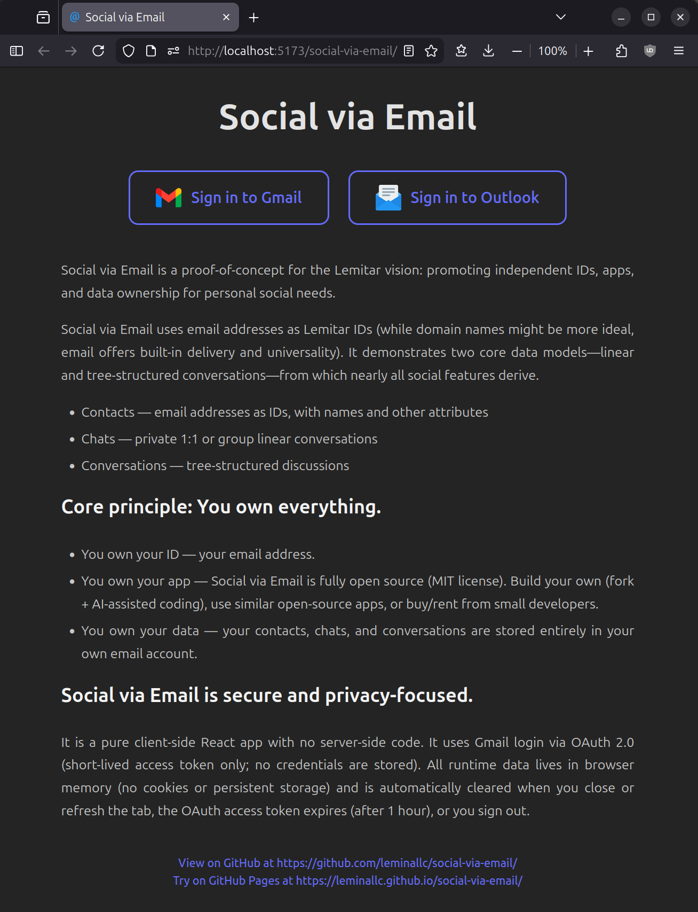</a>

## 1. What is Social via Email?

Social via Email turns your email account into a participant in a decentralized social network. It uses email addresses as your social ID and your email account as your personal database. There is no server. There is no sign-up. You sign in with your own Gmail or Outlook account, and everything lives in your inbox.

It demonstrates two core data models — linear and tree-structured — from which nearly all social features derive:

- **Contacts** — email addresses as IDs, with names and profile images
- **Chats** — private 1:1 or group linear conversations
- **Conversations** — tree-structured threaded discussions

This is a proof-of-concept for the Lemitar vision: promoting independent IDs, apps, and data ownership for personal social needs.

- **You own your ID** — your email address. No platform-specific username, no account to lose.
- **You own your app** — Social via Email is fully open source (MIT license). Fork it, build your own, or use similar apps from other developers.
- **You own your data** — your contacts, chats, and conversations are stored entirely in your own email account. No one else has access.

## 2. Running the App

**Option A: Use the hosted version**

The app is hosted on GitHub Pages directly from this repository's `docs/` folder — what you see is exactly what's in the repo. No installation needed: [https://leminallc.github.io/social-via-email/](https://leminallc.github.io/social-via-email/).

**Option B: Run locally**

Clone the repository (or download the ZIP from GitHub — no Git required):

```bash
npm install
npm run dev
```

The app runs at [http://localhost:5173/social-via-email/](http://localhost:5173/social-via-email/).

## 3. How It Works

### 3.1. Email as Your Database

When you click **Save**, the app serializes your entire state (contacts, chats, conversations) into a single JSON string and stores it as the body of an email in your account. This email has the subject `memory-dump` and is sent from `sve@localhost` — a special address that ensures the email stays internal to your account and goes nowhere.

Since email is immutable, every Save creates a new `memory-dump` email and deletes the previous one. There is only ever one.

You can open this email in Gmail or Outlook and see your data in plain JSON — it's your data, fully transparent.

<a href="readme-images/gmail-memory-dump-list.png">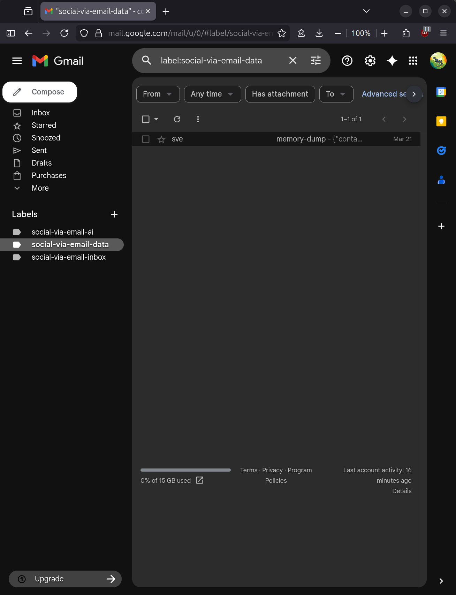</a> <a href="readme-images/gmail-memory-dump-content.png">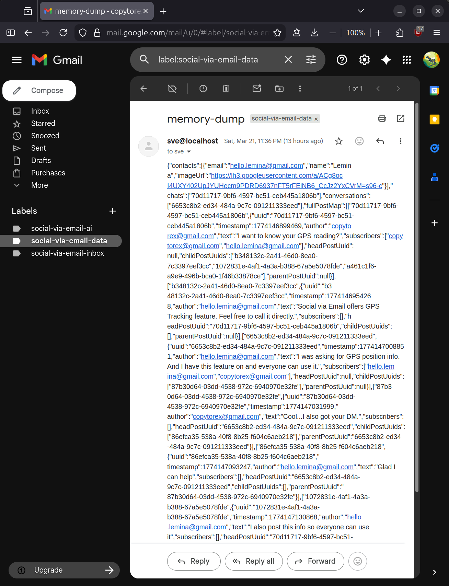</a>

### 3.2. Email as Communication

When you add a contact, send a chat message, or post in a conversation, the app sends an email to the recipient with a structured JSON envelope in the body. The subject line is `Lemitar::Social-via-Email`. When the recipient clicks **Scan**, the app reads these emails, processes the commands, and moves them to trash.

All communication is peer-to-peer through email. There is no central server relaying messages.

Take a look at these emails in your Trash after a Scan — the JSON body reveals the protocol and the actual data exchanged between users. Exploring these envelopes is the best way to understand how the app communicates.

### 3.3. Three Gmail Labels (or Outlook Folders)

The app automatically creates three labels in your email account:

| Label | Purpose |
|---|---|
| `social-via-email-data` | Stores the `memory-dump` email containing your saved state |
| `social-via-email-inbox` | Optional. You can set up an email filter rule to route incoming Lemitar emails here, keeping your regular inbox clean. The app does not require this — it's your choice. |
| `social-via-email-ai` | When Scan encounters emails it cannot parse (malformed JSON, natural language, etc.), it moves them here for a future AI agent or for you to handle manually. |

If you expect a lot of Lemitar traffic, create a filter rule in Gmail (or Outlook) to automatically move emails with subject `Lemitar::Social-via-Email` to the `social-via-email-inbox` label. This keeps your regular inbox clean.

## 4. Getting Started

### 4.1. Sign In

Click **Sign in to Gmail** or **Sign in to Outlook**. A popup window from Google (or Microsoft) will appear — the app itself never sees your password.

The app requests the following permissions:

| Permission | Why the app needs it |
|---|---|
| See your profile info | To identify you — your name, email address, and profile picture become your social identity |
| Read your emails | To scan for incoming messages from other Social via Email users |
| Compose and send emails | To send messages (chats, conversation posts, contact requests) to other users |
| Manage labels | To create and use the three labels (`social-via-email-data`, `-inbox`, `-ai`) that organize the app's emails |
| Move emails | To move processed incoming emails to trash after scanning |

**This is safe.** As described in [Tech Stack and Security](#7-tech-stack-and-security), the app has no server — the OAuth token is short-lived (1 hour), stored only in browser memory, and cleared when you close the tab, refresh, or sign out.

Once you grant permissions, the popup closes and you are signed in. If this is your first time with OAuth 2.0, see [Section 6](#6-oauth-20-granting-and-revoking-access) for a step-by-step screenshot walkthrough.

### 4.2. First-Time Initialization

After sign-in, the app lands on the **Logs** tab and automatically runs initialization:

1. **initializeLabels** — creates (or finds) the three email labels described above
2. **loadEmailToState** — looks for an existing `memory-dump` email to restore your saved state
3. **scanIncomingEmails** — checks for any new incoming messages from other users
4. **deleteSentEmails** — cleans up previously sent Lemitar emails

<a href="readme-images/logs-tab.png">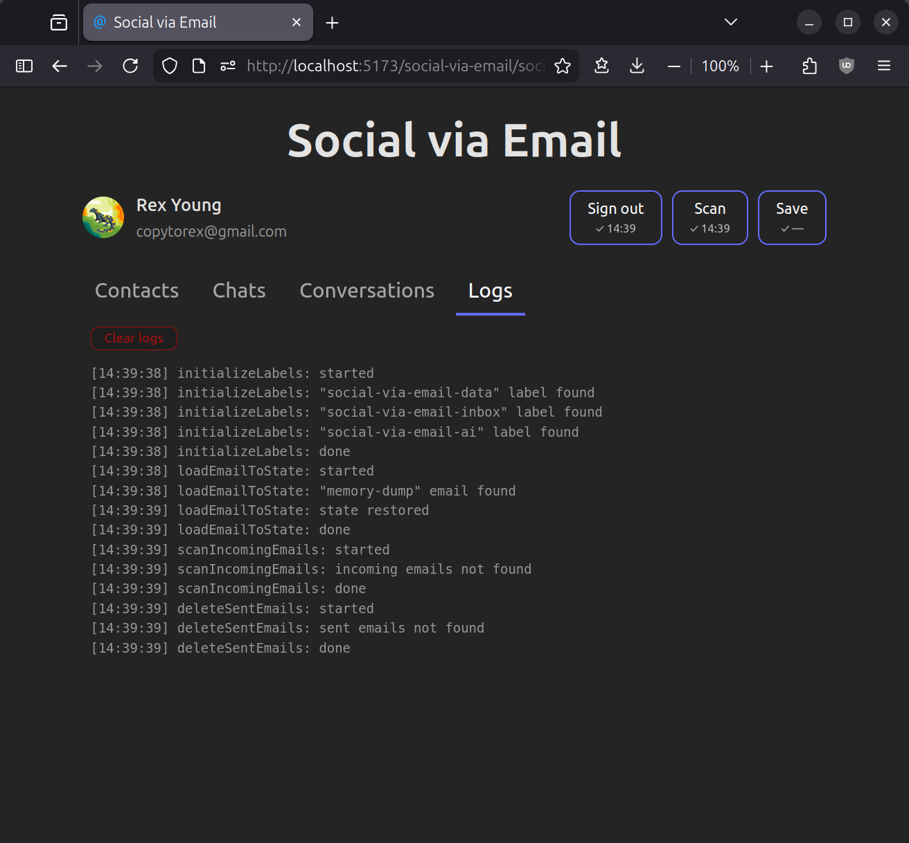</a>

If this is your first time, there will be no saved state — the app starts fresh.

### 4.3. Scan and Save Are Manual

After the initial automatic scan on login, both **Scan** and **Save** are manual actions. You decide when to check for new messages and when to persist your data. This is by design — you stay in control and can observe exactly what happens.

The orange dot on the **Save** button is a "dirty" indicator — it appears whenever you have unsaved changes in memory. Click **Save** to persist your data. **Save before closing the tab** — the app holds all state in browser memory and unsaved changes are lost if you close the tab, refresh, or your session expires.

It is strongly recommended to keep Social via Email and Gmail (or Outlook) open side by side. Since Scan and Save are manual, you have time to inspect the raw JSON emails in your inbox or trash — this is the clearest way to understand the protocol and verify what the app is doing.

**Recommended workflow:**
1. Clear the logs (click **Clear logs**)
2. Perform an action (add a contact, send a chat, etc.)
3. Switch to the **Logs** tab to see what happened
4. Optionally, open your email account to inspect the raw JSON emails

### 4.4. Revoking Access

You can revoke Social via Email's access to your account at any time. For a step-by-step walkthrough with screenshots, see [Section 6](#6-oauth-20-granting-and-revoking-access).

- **Gmail:** Go to [Google Account → Third-party apps & services](https://myaccount.google.com), find **Social via Email**, and click **Remove all access**.
- **Outlook:** Go to [Microsoft account app permissions](https://account.live.com/consent/Manage) and remove Social via Email from the list.

## 5. Features

### 5.1. Contacts

<a href="readme-images/contact-tab-with-dialog.png">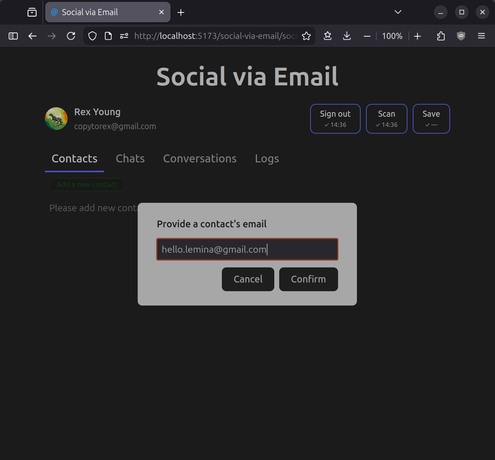</a> <a href="readme-images/contact-tab-list.png">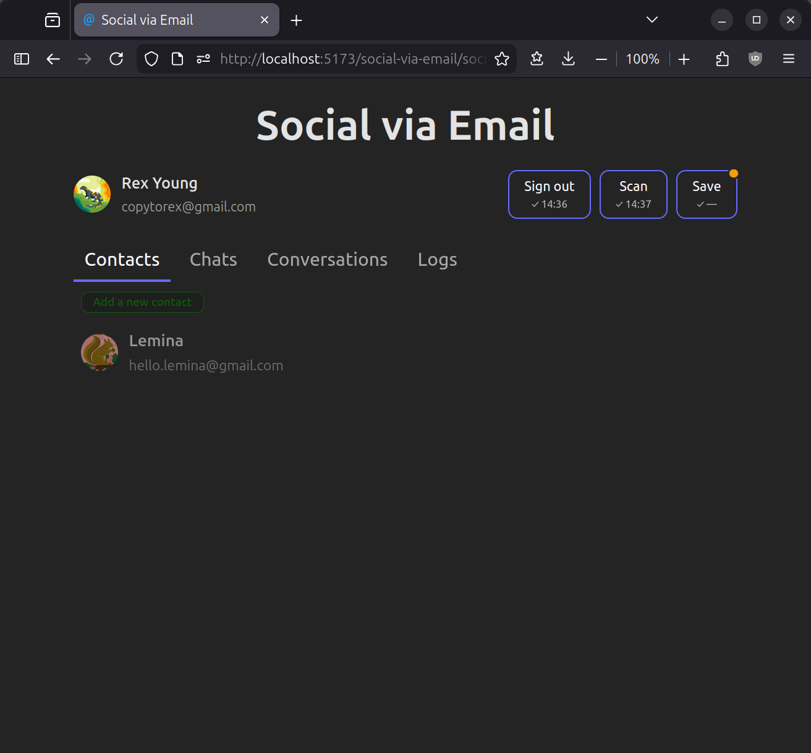</a>

Adding a contact is a multi-step protocol that happens automatically across two rounds of scanning:

1. You click **Add a new contact**, enter their email address, and click **Confirm**
2. The app sends a Receptionist inquiry — an automated handshake that verifies the recipient also runs Social via Email and discovers their supported features
3. Once verified, a contact request is sent
4. When the recipient runs **Scan**, the request is auto-accepted and a confirmation is sent back
5. When you run **Scan** again, the mutual contact is established — both sides now have each other

This means both users need to **Scan twice** for the contact to be fully added on both sides. "Scan twice" does not mean clicking Scan two times in a row — each Scan only picks up emails that have already arrived. You need to wait for the other side to Scan and reply before your next Scan will find anything new. In practice:

- **Scan** on both sides (round 1) — exchanges the receptionist inquiry
- **Scan** on both sides (round 2) — exchanges the contact request and acceptance

This back-and-forth may feel slow, but it is a consequence of email being an asynchronous protocol — each Scan can only process emails that have already been delivered.

### 5.2. Chats

<a href="readme-images/chats-tab-with-dialog.png">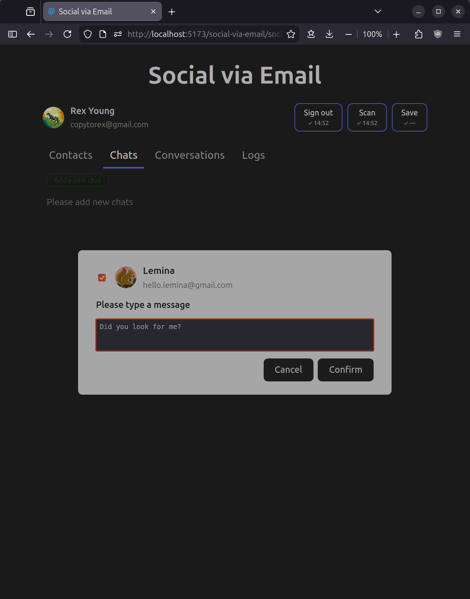</a> <a href="readme-images/chats-tab-expanded.png">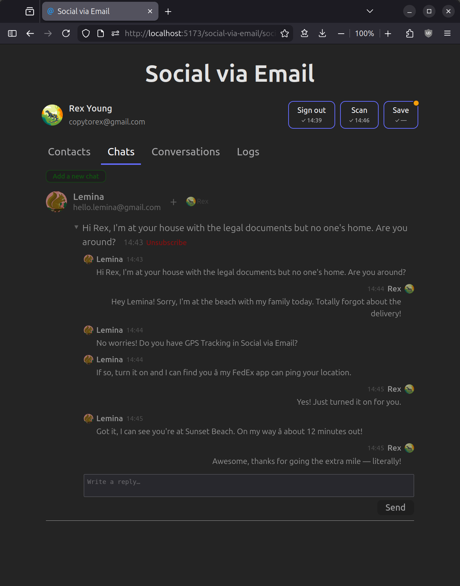</a>

Chats are private linear conversations — 1:1 or group. All participants see all messages in chronological order.

Each chat shows who started it, the participants, and the opening message. Click the expand arrow to reveal the full thread with a reply box at the bottom.

To start a chat:
1. Click **Add a new chat** — a dialog appears listing all your contacts with checkboxes
2. Select one or more contacts — selecting one contact creates a private direct message; selecting multiple creates a group chat
3. Type your opening message
4. Click **Confirm** — the message is sent to all selected contacts

To reply in a chat:
1. Click the expand arrow on a chat to see the message thread
2. Type your reply in the text box at the bottom
3. Click **Send**

Your own messages appear right-aligned. Other participants' messages appear on the left with their avatar and name.

To leave a chat:
1. Expand the chat
2. Click **Unsubscribe** — you are removed from the chat and other participants are notified

When someone leaves a chat, the remaining participants retain all messages and the full subscriber list, so the conversation continues uninterrupted — even if the original chat creator leaves.

### 5.3. Conversations

<a href="readme-images/conversations-tab-with-dialog.png">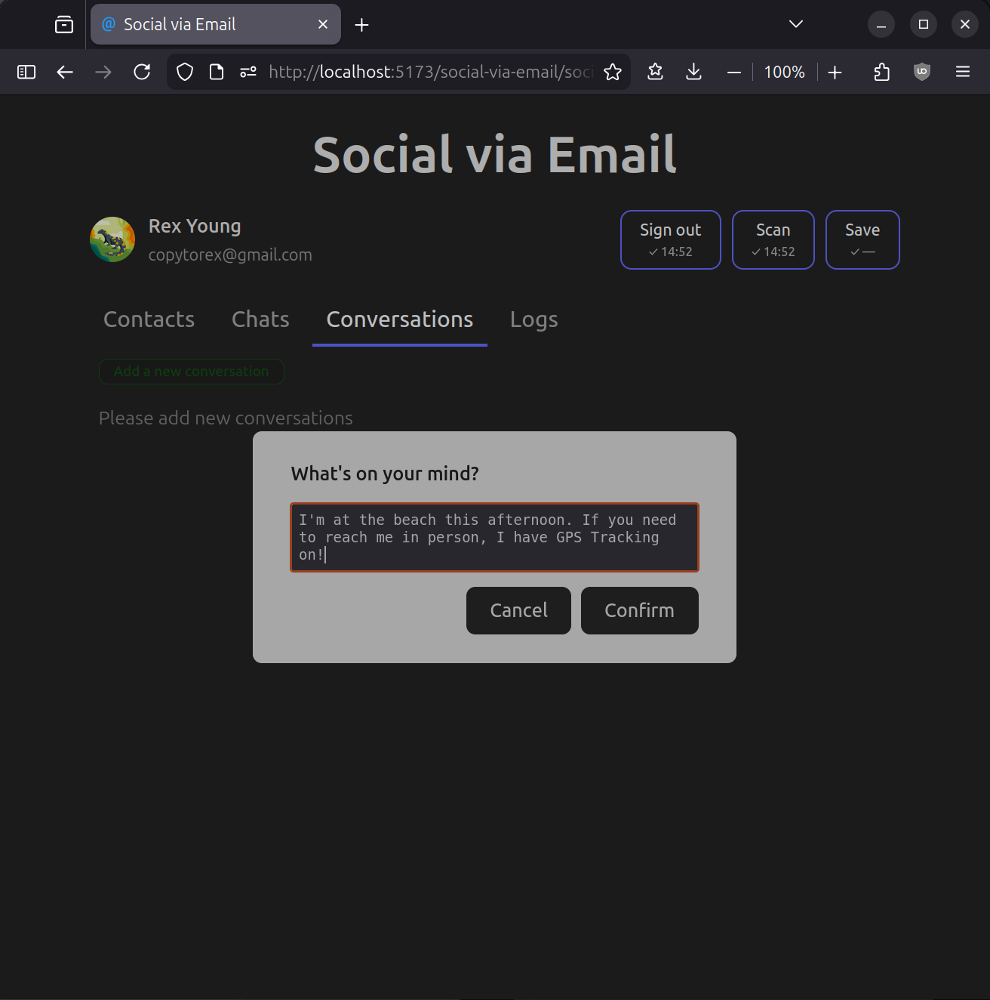</a> <a href="readme-images/conversations-tab-expanded.png">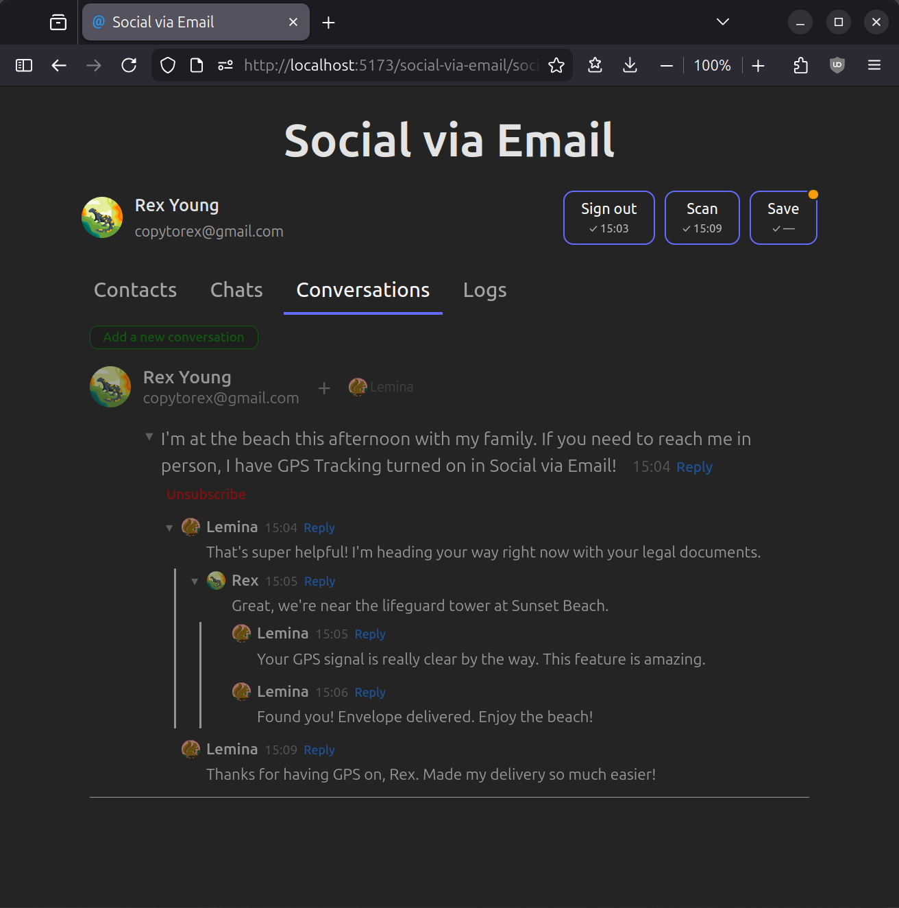</a>

Conversations are tree-structured threaded discussions. Unlike chats, you can reply to any specific post, creating nested threads — similar to Reddit or forum-style discussions.

To start a conversation:
1. Click **Add a new conversation**
2. Type your post
3. Click **Confirm** — the post is sent to all your contacts (all contacts are automatically added as subscribers)

To reply to a specific post:
1. Expand a conversation to see the thread tree
2. Click **Reply** on the post you want to respond to
3. A popup dialog appears with the quoted post for context
4. Type your reply and click **Confirm**

Unlike chats where there is a single reply box for the whole thread, conversations have a **Reply** button on each individual post, allowing you to branch the discussion at any point.

Replies appear nested under the post they respond to, with visual indentation showing the tree structure.

To leave a conversation:
1. Expand the conversation
2. Click **Unsubscribe** — the conversation and all its posts are removed from your local state

### 5.4. Logs

The Logs tab shows a chronological record of all operations the app performs — label initialization, email scanning, sending, saving, and any errors. It provides full transparency into what the app is doing with your email account.

- Click **Clear logs** to reset the log display
- Logs are timestamped in `HH:MM` format

## 6. OAuth 2.0: Granting and Revoking Access

OAuth 2.0 is a well-known standard — plenty of resources cover it in depth. The walkthroughs below use Gmail. Because Social via Email depends on OAuth 2.0 to function, we include at least one worked example so nothing is left to guesswork. If you use Outlook, the flow is similar — the screens will look different but the steps follow the same pattern.

<details>
<summary>Step-by-step screenshot walkthroughs</summary>

### 6.1. Granting Access via Sign-In

**Step 1 — Sign in to your Google account.** Enter your email and password as you normally would. If you have 2-Step Verification enabled, complete that as well. This is standard Google sign-in — the same as signing in to any Google service.

<a href="readme-images/gmail-oauth-1-email.png">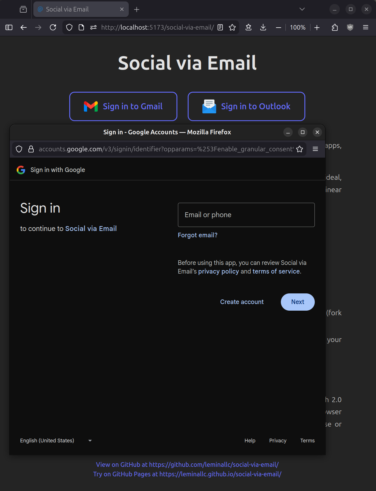</a> <a href="readme-images/gmail-oauth-2-password.png">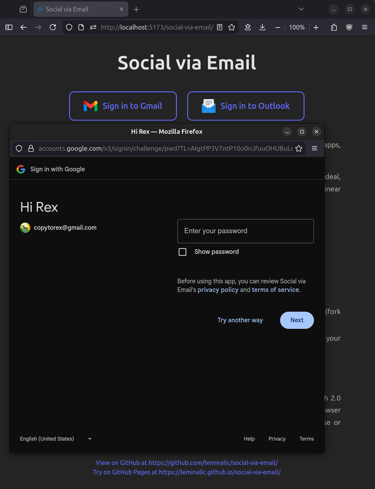</a>

<a href="readme-images/gmail-oauth-3-2step.png">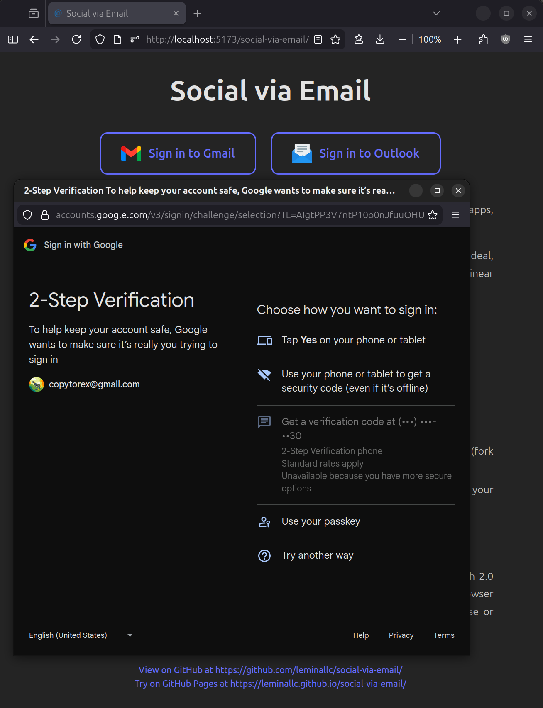</a>

**Step 2 — "Google hasn't verified this app" warning.** You may see this screen because Social via Email is an open-source project in testing mode and has not gone through Google's app verification process. This is expected. Click **Continue** to proceed.

<a href="readme-images/gmail-oauth-4-unverified.png">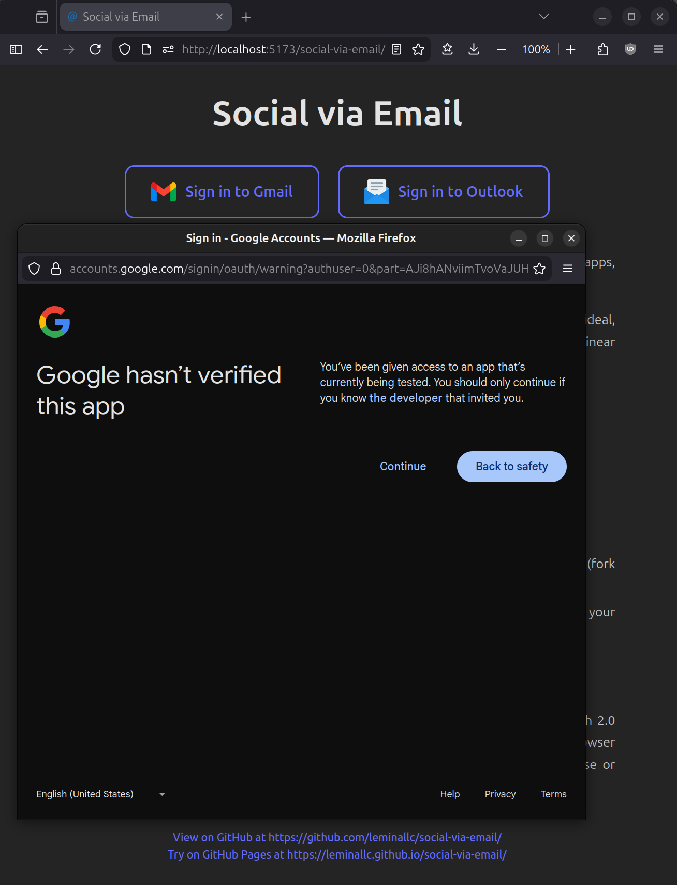</a>

**Step 3 — Grant permissions.** Google will show you exactly what Social via Email is asking to access. Review the permissions and click **Continue**.

<a href="readme-images/gmail-oauth-5-profile-consent.png">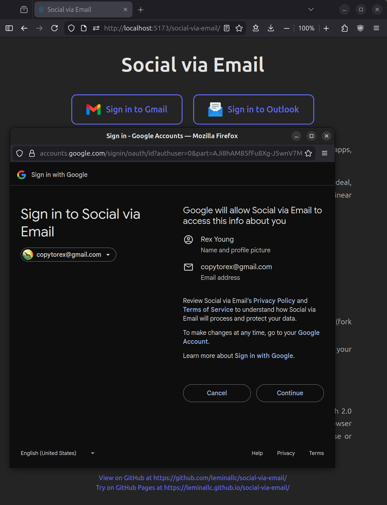</a> <a href="readme-images/gmail-oauth-6-gmail-consent.png">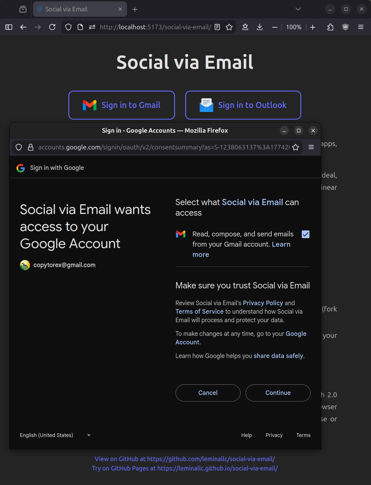</a>

You can click **Learn more** to see the detailed permission breakdown:

<a href="readme-images/gmail-oauth-7-permission-details.png">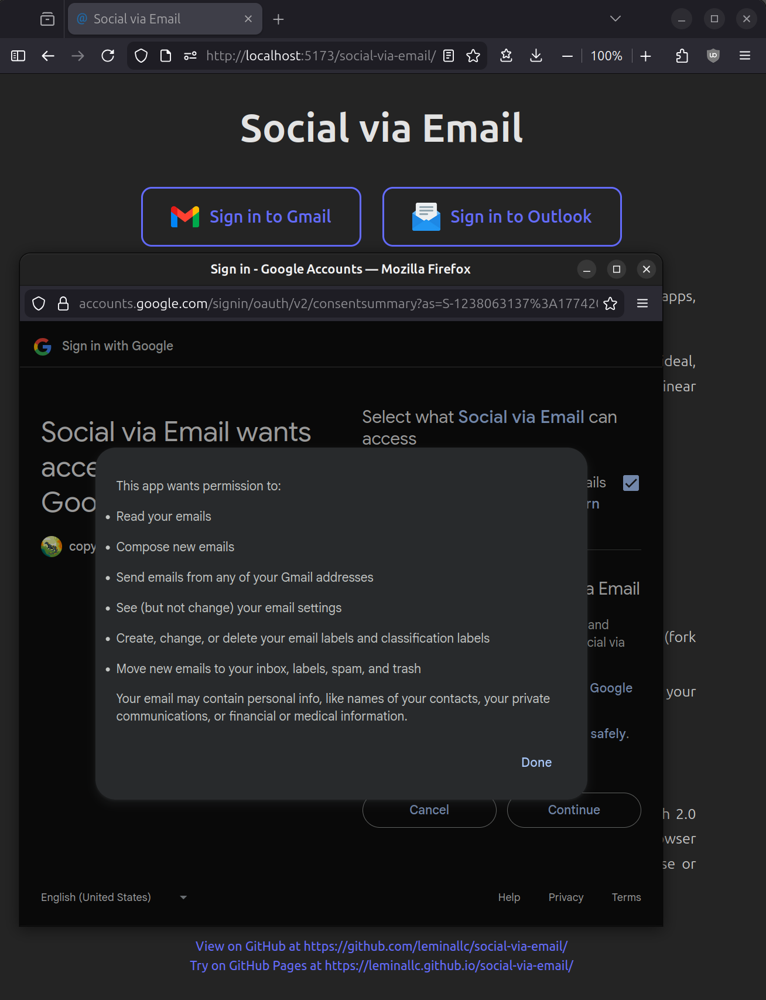</a>

Once you click **Continue**, the popup closes and you are signed in.

### 6.2. Revoking Access When You're Done with the App

Revoking access is done through your Google account — not through Social via Email itself. It permanently removes the app's permission to access your Gmail. This is something you do once when you have fully decided to stop using the app, not as a routine step after each session — signing out of Social via Email is enough for day-to-day use. To revoke:

1. Go to your [Google Account](https://myaccount.google.com)
2. Click **Third-party apps & services** in the left sidebar
3. Find and click **Social via Email**
4. Review the permissions, then click **Remove all access**

<a href="readme-images/gmail-revoke-home.png">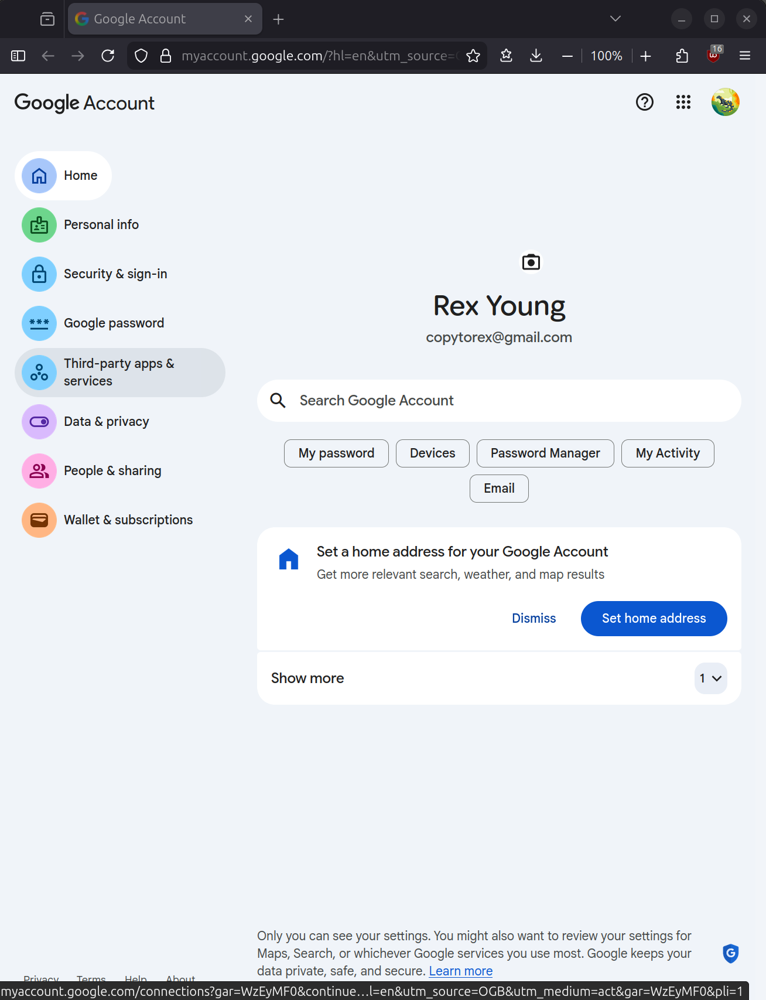</a> <a href="readme-images/gmail-revoke-third-party.png">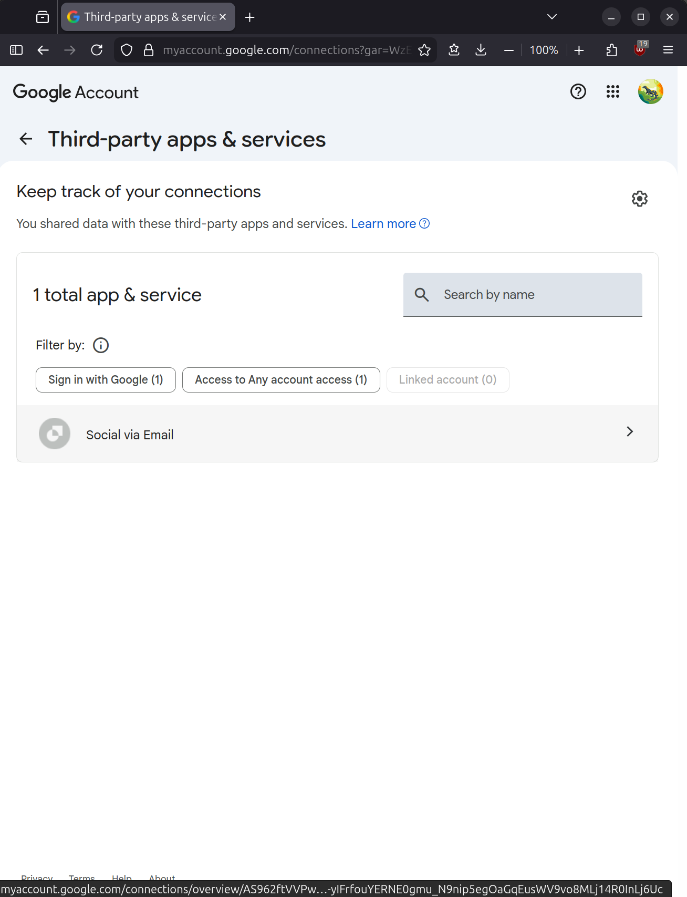</a>

<a href="readme-images/gmail-revoke-sve-overview.png">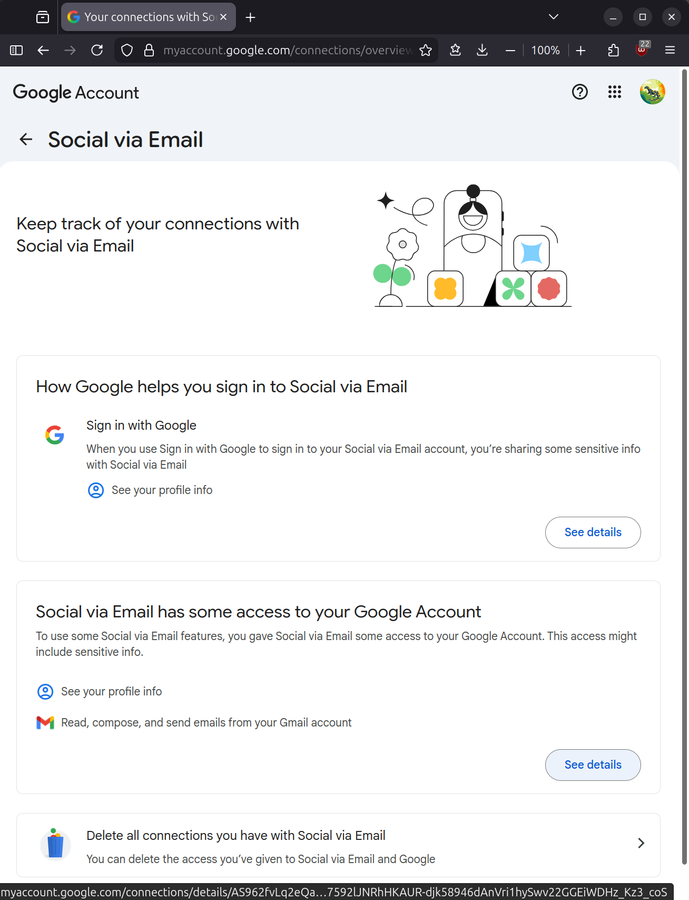</a> <a href="readme-images/gmail-revoke-sve-details.png">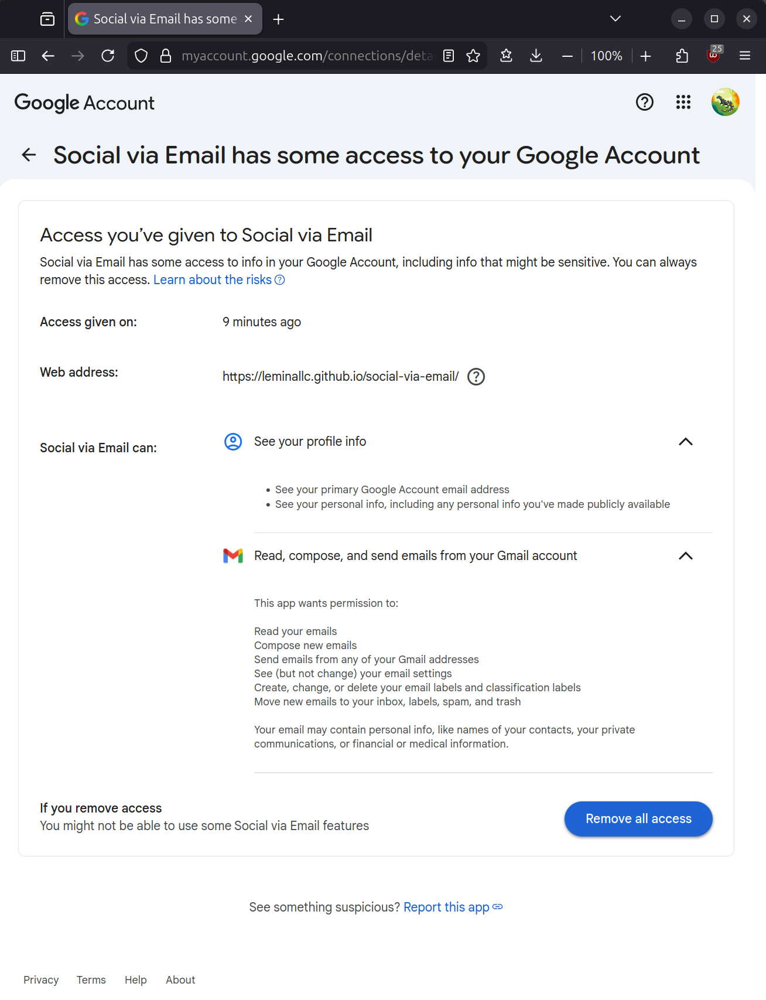</a>

</details>
